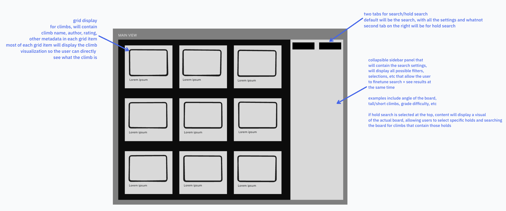
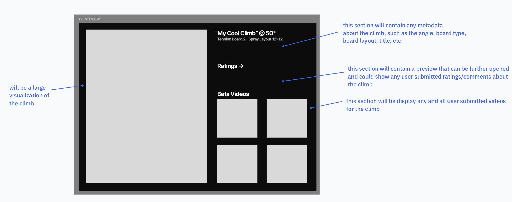

# Problem Statement: Bouldering Training Board Discovery

## Problem Domain: Board Training

Training focused on specific skill development for climbing through structured practice on angle-adjustable training boards. As someone who has taken rock climbing seriously as a central part of my life, I've experienced firsthand the challenges of optimizing training sessions on various training boards. Boards like the MoonBoard, Kilter Board, and Tension Board have become essential tools for climbers seeking consistent, measurable progress, offering thousands of user-generated problems with mostly standardized difficulty ratings. My personal investment in climbing performance and countless hours spent navigating training resources has given me good insight into the friction points that prevent climbers from maximizing their training efficiency.

## Problem: Inefficient Discovery of Board Climbs

Climbers struggle to efficiently find training board problems that match their specific training goals, current ability level, and available time, leading to suboptimal training sessions and frustration. The current process requires climbers to manually scroll through hundreds of problems, often filtered only by basic difficulty grades, without the ability to search by specific holds, movement patterns, training focus areas, or personal performance history. This results in climbers spending excessive time hunting for appropriate challenges instead of actually climbing.

## Stakeholders

- **Developing Climbers**: beginner/intermediate climbers seeking systematic progression who are new to training boards need problems that target specific weaknesses and skill gaps in their climbing technique without being overly difficult and scaring them from further training
- **Advanced Climbers**: experienced athletes requiring highly specific training who need efficient access to problems matching their performance level and training periodization
- **Climbing Coaches**: trainers who are looking to design structured programs for clients and need to quickly locate problems that align with specific training objectives
- **Gym Owners**: those who directly invest in expensive training boards and want to maximize usage and satisfaction with their equipment
- **Route Setters**: people who create their own problems on the training boards and want their routes to be discoverable by the right audiences

## Evidence and Comparables

1. [Awesome climbing search: Better climbing route search](https://www.reddit.com/r/tradclimbing/comments/1jd0v8i/awesome_climbing_search_better_climbing_route/) - active climbing community discussion highlighting the need for improved route search functionality, with climbers expressing frustration about existing outdoor route databases lacking sophisticated filtering options.

2. [I made a holds search for Kilter climbs](https://www.reddit.com/r/climbharder/comments/1auql18/i_made_a_holds_search_for_kilter_climbs/) - existing community-built solution demonstrating demand for hold-specific search functionality, showing that climbers are actively seeking tools to filter problems based on specific grips and movement patterns.

3. [Search-by-holds for MoonBoard](https://www.reddit.com/r/climbharder/comments/faght6/searchbyholds_for_moonboard/) - Examples of attempts by the community to create hold-based search tools for the MoonBoard, indicating a need for more granular problem discovery methods.

4. [Deeply demoralized by Kilter board](https://www.reddit.com/r/bouldering/comments/1betcca/deeply_demoralized_by_kilter_board/) - some user frustration with the climbs on the Kilter training board, showing the need for better discovery that is more accurate to the skill level of users, especially beginners.

5. [Unable to do anything on a moonboard](https://www.reddit.com/r/climbharder/comments/1k24fx0/unable_to_do_anything_on_a_moonboard/) - Also further frustration by a user with a different training board ab out the difficulty of climbs, could also be solved with better tailored, granular search functionality that provides more appropriate climbs for their ability

# Application Pitch: Boardlord

## Motivation

Boardlord solves the time-wasting problem of climbers manually hunting through hundreds of training board problems to find climbs that match their specific skill level and training goals.

## Key Features

**Advanced Search** enables climbers to filter problems by specific holds, movement types, and training focus areas rather than just difficulty grades. This helps developing climbers find problems that address their specific weaknesses while allowing advanced climbers to search specifically for a climb they may have seen but not remember the name of.

**Board View** is an interactive visual representation of the training board with color-coded highlighted holds showing exactly which grips to use for each problem. This helps developing climbers understand the intended sequence before attempting a problem and allows advanced climbers to quickly create/understand movement patterns.

**Beta Sharing** allows climbers to easily view user submitted videos containing beta, (the way someone climbed something) so that if they were stuck or confused about how to do a climb, they could view how someone else completed it.

# Concept Design

## Concept Specifications

## Problem [Board, User]

```
concept Problem [Board, User]

purpose
    represent climbing routes on training boards with holds, difficulty, and movement patterns

principle
    after creating a problem on a board with specific holds and attributes,
    users can discover and attempt the problem based on its characteristics

state
    a set of Problems with
        a problemId String
        a name String
        a grade String
        a holds containing a set of Strings  // hold positions on board
        a movementTypes containing a set of Strings  // crimp, dyno, heel hook, etc.
        a board Board
        a setter User

actions
    createProblem(name: String, grade: String, holds: set of Strings,
                  movementTypes: set of Strings, board: Board, setter: User): (problem: Problem)
        effect:
            generate unique problemId
            create new problem with given attributes
            return the created problem

    getProblemsByBoard(board: Board): (problems: set of Problems)
        effect:
            return all problems on the specified board

    getProblemsByGrade(grade: String): (problems: set of Problems)
        effect:
            return all problems matching the specified grade
```

## Filter [Item]

```
concept Filter [Item]

purpose
    enable advanced search through collections of items based on multiple criteria

principle
    after adding search criteria to a filter, applying it to a collection
    returns only items matching all specified criteria

state
    a set of Filters with
        a filterId String
        a criteria mapping from String to set of Strings  // key-value search criteria

actions
    createFilter(): (filter: Filter)
        effect:
            generate unique filterId
            create filter with empty criteria
            return the created filter

    addCriteria(filter: Filter, key: String, values: set of Strings)
        requires:
            filter exists
        effect:
            add or update criteria[key] = values in filter

    search(filter: Filter, items: set of Items): (results: set of Items)
        requires:
            filter exists
        effect:
            return items that match all criteria in filter

    clearFilter(filter: Filter)
        requires:
            filter exists
        effect:
            remove all criteria from filter
```

## BoardView [Problem]

```
concept BoardView [Problem]

purpose
    display visual representation of problems on training boards with highlighted holds

principle
    after selecting a problem, the board view shows exactly which holds to use with color-coded highlights for start, intermediate, and finish positions

state
    a set of Displays with
        a displayId String
        a problem Problem
        a highlightedHolds containing a set of Strings
        a isVisible Flag

actions
    showProblem(problem: Problem): (display: Display)
        effect:
            generate unique displayId
            create display with problem and its holds as highlightedHolds
            set isVisible = True
            return the created display

    hideDisplay(display: Display)
        requires:
            display exists and isVisible = True
        effect:
            set display.isVisible = False

    getVisibleDisplays(): (displays: set of Displays)
        effect:
            return all displays where isVisible = True
```

## BetaVideo [Problem, User]

```
concept BetaVideo [Problem, User]

purpose
    share video demonstrations of climbing techniques for specific problems from external sources

principle
    after importing a video from Instagram or board apps for a problem, other users can view it to learn
    the climbing sequence and technique from existing community content

state
    a set of Videos with
        a videoId String
        a problem Problem
        a videoSource String  // "instagram", "tensionboard", "moonboard", etc.
        a videoUrl String  // Instagram URL or board app URL
        an importTime TimeStamp

actions
    importFromInstagram(problem: Problem, instagramUrl: String): (video: Video)
        effect:
            generate unique videoId
            get current timestamp
            create video with videoSource = "instagram" and given Instagram URL
            return the created video

    importFromBoardApp(problem: Problem, boardAppSource: String, videoUrl: String): (video: Video)
        effect:
            generate unique videoId
            get current timestamp
            create video with videoSource = boardAppSource and given URL
            return the created video

    getVideos(problem: Problem): (videos: set of Videos)
        effect:
            return all videos associated with the specified problem

    removeVideo(video: Video)
        requires:
            video exists
        effect:
            remove video from Videos
```

## Essential Synchronizations

```
sync viewProblem

when
    Request.viewProblem(user, problem)
    BetaVideo.getVideos(problem): (videos)

then
    BoardView.showProblem(problem): (display)

sync searchAndDisplayProblems

when
    Request.searchProblems(user, criteria)
    Filter.createFilter(): (filter)
    Filter.addCriteria(filter, criteria)
    Problem.getProblemsByBoard(selectedBoard): (problems)
    Filter.search(filter, problems): (results)

then
    for each result in results:
        BoardView.showProblem(result)

sync importBetaVideo

when
    Request.addBetaVideo(user, problem, videoUrl, source)

then
    if source = "instagram":
        BetaVideo.importFromInstagram(problem, videoUrl)
    else:
        BetaVideo.importFromBoardApp(problem, source, videoUrl)
```

## Concept Context

The **Problem** concept serves as the core data model, storing all climbing route information including holds and movement patterns needed for the Advanced Search feature. **Filter** provides the advanced search functionality, allowing users to query problems by holds, movement types, and difficulty grades. **BoardView** implements the visual board representation, taking problems from the Problem concept and displaying them with highlighted holds. **BetaVideo** enables the beta sharing feature, linking user-uploaded videos to specific problems.

The Filter concept is instantiated with Problem as the Item type, enabling search across all climbing routes. BoardView is instantiated with Problem to visualize specific routes on training boards. BetaVideo links to both Problem (for route association) and User (for video ownership and access control).

## UI Sketches

### Home View

Main interface user will see upon visiting, straightforward and easy to browse. Will display climbs based on simple recommendations or popularity if no search, otherwise, can save the filters from user's last session and display search results from that query.



### Climb View

Secondary interface user will see upon clicking a climb. Will display the climb visualization in bigger/greater detail, as well as display more metadata that may not be shown on the grid view. Will also contain any videos users have submitted.



## User Journey

Alex is an intermediate climber who joined a gym with a Kilter board. They want to train systematically but feel overwhelmed browsing through hundreds of problems in the official app, most of which seem either too easy or impossibly hard. After spending 20 minutes scrolling through random V4s and V5s, they give up frustrated and just repeat the same few problems they completed last week.

Next session, Alex opens Boardlord. The home interface (view 1) shows a clean grid of problems with basic filtering options at the top. They select 40° as their board angle and set filters for "V4-V5" grade and "crimp-heavy" movement style since they want to work on finger strength. The results immediately show a smaller subset of relevant problems instead of hundreds of random routes.

Alex clicks on a problem that looks interesting. The climb view (view 2) displays the full board visualization with highlighted holds in different colors for start, hand holds, foot holds, and finish positions. After a few minutes of struggling, Alex can't seem to figure out a way to do the climb that suits his body type, as they're on the shorter end heightwise. Luckily, Alex sees plenty of beta videos providing different solutions to the climb from all types of people. They find a video from someone of a similar stature who completed the climb.

After watching the video, Alex heads back to the board knowing exactly which holds to use and having seen an approach that suits his body type. They successfully complete the climb, then return to Boardlord to find similar crimp-heavy problems to continue their focused training session. Instead of wasting time hunting for appropriate climbs, Alex spends the full hour actually climbing and improving the specific technique.
